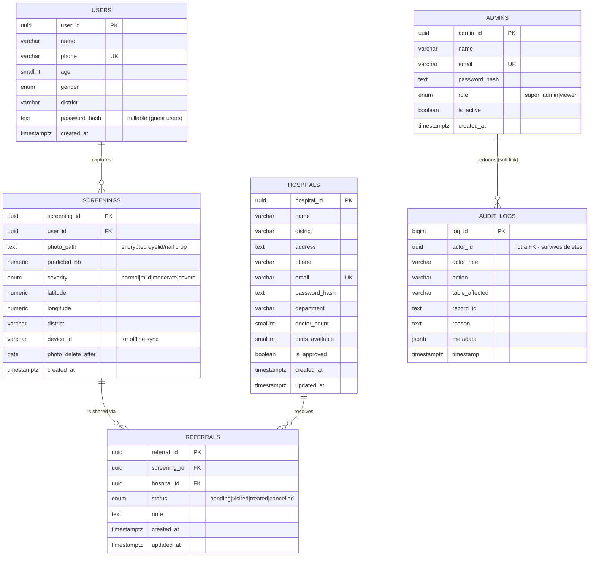

# AnemiaScan — ER Diagram & Data Model

The database has **six tables** plus two read-only **views**. One central fact table
(`screenings`) connects app users to hospitals.

## Relationship summary (plain English)

- One **user** can have many **screenings** — a `1 : N` link (`screenings.user_id → users.user_id`).
- One **screening** can be referred to many **hospitals**, and one hospital can receive many
  screenings. Because a referral is a *thing in itself* (it has a status), we model it with a
  join table, **referrals**, giving a `N : N` link between screenings and hospitals.
- **admins** and **audit_logs** stand apart: admins act on everything, and every such action is
  written to `audit_logs`. The log stores `actor_id` as a plain UUID (not a foreign key) so the
  history survives even if an account is deleted.

## Mermaid ER diagram

## Key design decisions

| Decision | Why |
|---|---|
| **UUID primary keys** | Generated with `gen_random_uuid()`; safe to create on a phone and sync without id clashes. |
| **ENUMs for severity / status / role** | The database rejects any value outside the allowed set — no typo'd severities ever enter the table. |
| **`users.password_hash` nullable** | The app is offline-first and login is optional, so a guest user can still have screening history. |
| **`screenings.device_id`** | Lets an offline phone upload screenings it captured before the user made an account. |
| **`referrals` join table with status** | A referral is an entity with a lifecycle (pending → visited → treated), not just a link. |
| **`audit_logs.actor_id` not a FK** | Audit history must never disappear when an admin account is deleted. |
| **Views (`v_dashboard_summary`, `v_anemia_by_district`)** | The dashboard reads pre-shaped aggregates; no heavy joins in the React layer. |
| **`photo_delete_after`** | Implements the 90-day auto-delete privacy promise at the data level. |

## Severity thresholds (used everywhere in the app)

| Severity | Hemoglobin (g/dL) | Colour |
|---|---|---|
| Normal | > 12.0 | green |
| Mild | 11.0 – 12.0 | amber |
| Moderate | 8.0 – 11.0 | orange |
| Severe | < 8.0 | red |
